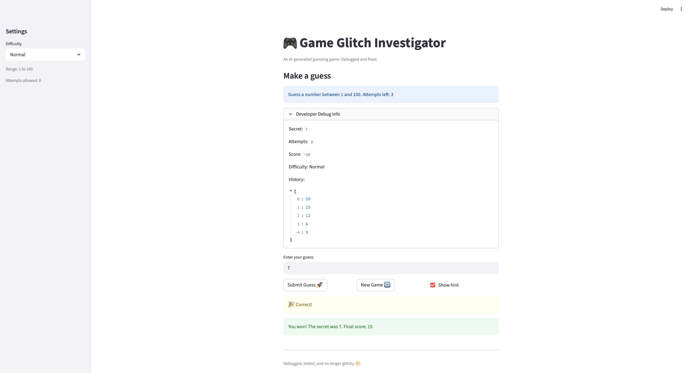
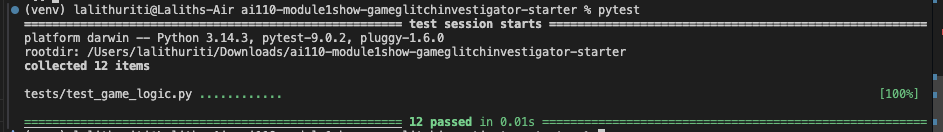

# 🎮 Game Glitch Investigator: The Impossible Guesser

## 🚨 The Situation

You asked an AI to build a simple "Number Guessing Game" using Streamlit.
It wrote the code, ran away, and now the game is unplayable. 

- You can't win.
- The hints lie to you.
- The secret number seems to have commitment issues.

## 🛠️ Setup

1. Install dependencies: `pip install -r requirements.txt`
2. Run the broken app: `python -m streamlit run app.py`

## 🕵️‍♂️ Your Mission

1. **Play the game.** Open the "Developer Debug Info" tab in the app to see the secret number. Try to win.
2. **Find the State Bug.** Why does the secret number change every time you click "Submit"? Ask ChatGPT: *"How do I keep a variable from resetting in Streamlit when I click a button?"*
3. **Fix the Logic.** The hints ("Higher/Lower") are wrong. Fix them.
4. **Refactor & Test.** - Move the logic into `logic_utils.py`.
   - Run `pytest` in your terminal.
   - Keep fixing until all tests pass!

## 📝 Document Your Experience

- [ ] Describe the game's purpose.
The goal of the game is to guess a randomly generated number within a limited number of attempts. The game provides feedback after each guess (too high, too low, or correct) and updates the player’s score based on performance. It was originally generated by AI but contained several logic and state-related issues.

- [ ] Detail which bugs you found.
I found multiple bugs while testing the game. The hint logic was reversed, so it gave incorrect directions (e.g., saying “go higher” when the guess was too high). The secret number was inconsistently treated as both a string and an integer, leading to unreliable comparisons. The attempt counter was off by one, and the difficulty settings did not match the actual number range used in the game. Additionally, starting a new game ignored the selected difficulty.

- [ ] Explain what fixes you applied.
I fixed these issues by standardizing data types (keeping the secret as an integer), correcting the hint logic, and fixing the attempt counter initialization. I updated the difficulty logic to ensure the correct number ranges were used and made sure the new game button properly reset the game state. I also refactored the core logic into a separate logic_utils.py file to improve readability and testability, and added pytest tests to verify that the game logic works correctly.

## 📸 Demo

- A screenshot of my fixed, winning game here

## 🚀 Stretch Features

- Completed Challenge 1: Advanced edge-case testing

